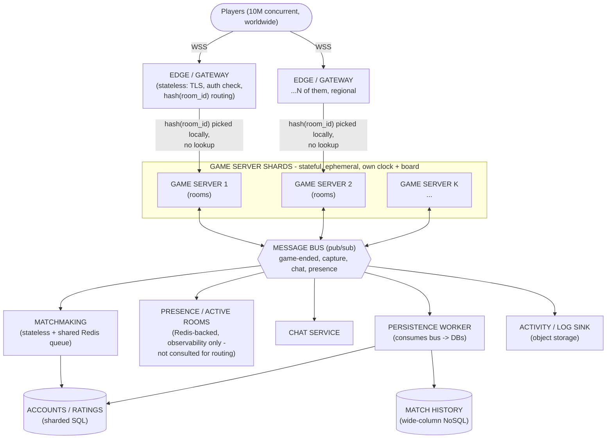

# KungFu Chess — Server-Side Scale Architecture

A design document for taking the single-process authoritative server to
internet scale: **100M registered users, 10M concurrent players, ~0.5 moves/sec
each, 30–90-second games.**

> Starting point (today): one Python websocket process (`python -m server`) that
> is the authoritative game and the **only place the clock advances**. It hosts
> many rooms in-process, does matchmaking, viewers, and disconnect-resign, keeps
> all state in memory, and writes activity logs to disk. Everything below is
> about breaking that single process into a fleet without losing its one
> non-negotiable property: *for any given room, exactly one process owns the
> clock and the authoritative state.*

---

## Part 0 — Vocabulary for a learner

Read this first; the rest of the document leans on these terms.

**Scale: vertical vs horizontal.**
- *Vertical scaling ("scale up")* = give one machine more CPU/RAM. Simple, but
  there is a hard ceiling (the biggest server you can rent) and it is a single
  point of failure. Our single Python process today can only scale vertically.
- *Horizontal scaling ("scale out")* = run **many machines** and spread work
  across them. No ceiling — you add more boxes. This is the only way to reach
  10M concurrent, and it is the central theme of this document. The cost is
  coordination: the machines must agree on *who owns what*.

**Docker / containers.** A container is a process plus a frozen copy of
everything it needs to run (Python version, libraries, our code) packaged into
one image. It behaves identically on a laptop, a CI runner, or a cloud VM —
"build once, run anywhere." It is *not* a virtual machine: it shares the host
kernel, so it starts in **milliseconds to a couple seconds** and is cheap enough
that you run *hundreds per host*. That startup speed is exactly what a game
lasting 30–90s needs.

**Why many containers when you have many servers.** A "server" (VM/host) is a
big box; a container is one small workload on it. You put *many* containers on
each host so a 32-core host can run, say, 50 game-server containers, each owning
a slice of the rooms. Containers are the unit you *replicate* and *replace*;
hosts are just where they land.

**Orchestrator (Kubernetes).** With thousands of containers, no human places
them by hand. An orchestrator is the autopilot: you declare *"I want N replicas
of the game-server image, each needs 0.5 CPU"* and it schedules them onto hosts,
restarts crashed ones, moves them off dying hosts, scales the count up/down on
load, and does rolling upgrades. Kubernetes (k8s) is the standard one.

**Load balancer.** One public address in front of many identical backends. It
spreads incoming connections across them (round-robin, least-connections, or by
a hash) and stops routing to instances that fail health checks. It lets clients
know *one* endpoint while we run thousands of servers behind it.

**Stateful vs stateless.**
- *Stateless* service = each request is self-contained; the process keeps nothing
  between requests that it couldn't rebuild from the database. Any replica can
  serve any request, so you scale it by cloning it behind a load balancer.
  (Auth, matchmaking API, the HTTP edge.)
- *Stateful* service = holds live in-memory data that a specific client depends
  on. Our **game-room server is stateful**: the live board, the clock, active
  moves. You cannot freely reroute a player mid-game to another replica — the
  other replica doesn't have that board. This is the hard part of the whole
  design.

**Sharding.** Splitting one logically-huge dataset across many machines so no
single machine holds it all. 100M user rows won't fit/serve from one DB, so you
*shard*: user IDs 0–9M on shard A, 9–18M on shard B, etc. Each shard is an
independent DB holding a slice. A routing rule (`shard = hash(user_id) % N`)
decides which shard owns a key.

**Message bus / pub-sub.** A shared channel servers use to talk *without knowing
each other's addresses*. A publisher emits an event ("game 42 ended, white won")
to a topic; any number of subscribers receive it. This is how a game-server
tells the persistence service, the presence service, and spectators about an
event at once, without point-to-point wiring. (Kafka, NATS, Redis Pub/Sub.)
Note: our codebase already has an in-process `EventBus` with exactly this shape —
crossing the network is "the same idea, over the wire," which the repo's
`protocol/events.py` already anticipates.

---

## Part 1 — Persistence for 100M registered users

### What actually needs to persist vs what is ephemeral

The single most clarifying decision is drawing this line:

| Data | Lifetime | Store |
|---|---|---|
| Accounts (id, username, password hash, email, created-at) | Forever | **Durable SQL, sharded** |
| Rating / ELO, W-L-D counts | Forever, updated per game | **Durable SQL, sharded** |
| Match history (who, when, result, maybe move log) | Forever, append-only, huge | **Wide-column / append store** |
| Friends, blocks | Forever | Durable SQL |
| **Live game state** (board, clock, active moves, who's in room) | **30–90 s, then gone** | **In-memory only** (game server + Redis) |
| Presence ("is user X online, on which server") | Seconds; rebuildable | **In-memory KV (Redis)** |
| Matchmaking queue | Seconds | In-memory KV |
| Activity logs | Forever, write-once | Object storage / log pipeline |

**The key insight:** the live game — the thing the current server keeps in
memory and advances the clock on — **must never touch the durable database on
the move path.** At 10M concurrent × 0.5 moves/s that is 5M writes/second, which
no accounts database should ever see. Live state lives in RAM; only the *result*
of a finished 30–90s game (one row: result + rating delta) is persisted. That is
~an order of magnitude less: with 90s games, 10M/90 ≈ **110k game-completions/s**
of durable writes, batched.

### Why SQLite is unsuitable

SQLite is an *embedded, single-file, single-writer* database — the whole DB is a
file opened by one process, and it serializes writers with a file lock. It is
excellent for the VPL text-grader path and tests, and genuinely bad here for
structural reasons, not tuning:

1. **No network access / no clients.** It has no server; other machines cannot
   connect to it. A 10M-concurrent fleet of stateless auth servers has nothing
   to connect *to*. It cannot be the shared source of truth for a cluster.
2. **Single writer.** One writer at a time, whole-database lock. Concurrent
   registrations and rating updates would serialize behind one lock.
3. **No horizontal scaling / replication.** No built-in sharding, no replicas,
   no failover. 100M user rows + match history is terabytes; it must span many
   machines, which SQLite cannot do.
4. **One machine = one point of failure.** The file lives on one disk. Lose the
   host, lose everything. No HA story.

SQLite is the *right* tool at the other end of the spectrum (one process, one
file, zero ops). We are at the opposite end.

### What class of DB fits

Split by access pattern, not by picking one database for everything (polyglot
persistence):

**(a) Accounts + ratings → a managed, horizontally-scalable relational store.**
These are structured, relational (users ↔ ratings ↔ friends), need
transactions (a rating update must be atomic and correct), and are read far more
than written. Use **SQL** — but a distributed/managed SQL engine, not a single
Postgres box:
- **Sharded managed SQL** (Amazon Aurora, Cloud SQL) with **read replicas** for
  the read-heavy login/profile traffic, or
- **NewSQL / distributed SQL** (CockroachDB, Spanner, Vitess-over-MySQL) which
  give you SQL semantics *and* transparent horizontal sharding + replication.

  *Sharding key:* `user_id`. 100M users is genuinely small per-row (a few KB) —
  order of **hundreds of GB**, so a handful of shards (e.g. 8–16) with 3× replication
  each is plenty. Ratings live on the same shard as the user.

**(b) Match history → wide-column / append-optimized NoSQL.** This is the big,
append-only, rarely-updated dataset (billions of rows, only ever written once
and read by "show my last 20 games"). A **wide-column store (Cassandra/ScyllaDB,
DynamoDB, Bigtable)** fits: partition by `user_id`, cluster by `timestamp`,
massive write throughput, linear horizontal scale, no joins needed. Using
NoSQL here (and SQL for accounts) is deliberate — different shape, different tool.

**(c) Ephemeral hot state → in-memory KV (Redis / Valkey cluster).** Presence,
matchmaking queues, the room→server directory, session tokens. Not the source of
truth; rebuildable; sub-millisecond; sharded across a Redis cluster. This is the
*coordination fabric*, discussed next.

**Managed vs self-hosted:** at this scale use **managed services**. You do not
want to hand-operate Cassandra failover or Postgres replication for 100M users
during a bootcamp *or* in production if you can pay a cloud to do it. Managed =
the provider handles replication, backups, failover, patching.

---

## Part 2 — Horizontal scaling to 10M concurrent players

One process caps out around, optimistically, tens of thousands of concurrent
websockets. 10M concurrent needs a **fleet**, and the whole game is: *how does
the fleet agree on who owns which room?*

### The component diagram

> Superseded from the first draft below: there is **no stored room directory**.
> `server = hash(room_id)` is a pure function every gateway and every game-server
> computes locally - nothing to write, nothing to go stale. See "The core
> problem" underneath for why, and what actually replaced it (`server/allocator.py`,
> implemented and tested this way, not just designed).



### The core problem: "which server owns this room?"

Because a game-room server is **stateful** (it holds the live board and *is* the
clock), a player's moves must always reach the *one* server that owns their room.
**One mechanism answers this, not two:**

**Consistent hashing** is both the placement rule and the lookup rule:
`server = hash_ring(room_id)`. There is no separate "authoritative record" to
keep in sync with it, because the hash *is* the authoritative record - any
gateway, any game-server, any client can compute the same answer independently,
with nothing to write on room creation and nothing to go stale on room teardown.
A hash ring (not `hash() % N`) is used so that adding or removing a game-server
only reshuffles ~`1/K` of rooms instead of remapping everything. Implemented in
`server/allocator.py::GameAllocator`, used identically by the WebSocket Gateway
(`server/ws_gateway.py::plan_route`) and by matchmaking when it mints a fresh
room id (`server/matchmaking.py`).

*Earlier draft of this document proposed a Redis-backed "room directory"
(`room_id → server`) alongside the hash ring, with the hash only deciding
*new*-room placement and the directory being the source of truth for *existing*
rooms. Building it surfaced the actual question: once placement is a pure
function of `room_id`, a stored record of the same fact adds a second source of
truth that can disagree with the first - two names for one number, one of which
can go stale. It was cut once that redundancy was visible, not before.*

There **is** a small piece of Redis state in the final design, but it plays a
different role: an **active-rooms presence registry** (`server/active_rooms.py`)
that servers write to when a room opens/closes, read only for fleet-wide
observability (a dashboard asking "how many games are running anywhere," see
`/metrics`'s `fleet_active_rooms`) - never consulted to route a player. Losing it
loses a number on a dashboard, not the ability to find a room.

Once a socket is routed, it is **sticky**: that player's connection stays pinned
to the owning game-server for the life of the (short) game. Stickiness is at the
*room* granularity, and it's cheap because games last 30–90s.

### How "everyone can play everyone" and "join any room" work across servers

- **Matchmaking is global, placement is local.** The matchmaking service is
  *stateless* and backed by a shared queue (Redis), partitioned by rating range.
  Any player from any region hits any matchmaking replica; it pops two
  compatible players from the shared queue - they can be on opposite sides of
  the planet and connected to different gateways. So "everyone can play
  everyone" holds because the *queue* is global, not per-server.
- When two players match, matchmaking **mints a room id and hashes it**
  (`hash_ring(room_id)`) to find the owning server, and hands both players that
  room - symmetrically: whichever of the two is co-located with the target seats
  locally, the other (and, if neither is, both) gets `Redirected(room_id)` and
  reconnects there. The two players never needed to be on the same gateway or
  region, and no write to any directory happens in between.
- **Joining an existing room** (as player or viewer): the same
  `hash_ring(room_id)` computation the joiner's own gateway can do locally -
  route the socket there. Works identically whether you're joining as a rated
  player or as a spectator; spectators are just read-only subscribers on that
  room's event stream.
- **Cross-server events** (a capture, game-ended, chat) fan out over the
  **message bus**, so spectators, the persistence worker, and presence all learn
  about them without the game-server knowing their addresses - the same
  publish/subscribe decoupling the repo already uses in-process.
- **Reconnecting mid-game.** Within the *same* game-server process, a dropped
  socket does not lose the seat: the room keeps counting down a resign grace
  period, and a session that reconnects with the same account is recognised and
  reseated in its own colour (`PlayerRegistry.seated_color`), not turned into a
  viewer. If the *process itself* dies mid-game, its rooms' live state (board,
  clock, in-flight moves) dies with it - deliberately not mirrored to Redis on
  every tick. For a 30-90s game the cost of doing that (serialising the whole
  board+arbiter+cooldown state on every move, for a failure mode that only
  matters for a handful of seconds of a short game) outweighs the benefit; the
  client instead returns its player to the home screen to re-queue for a fresh
  match, the same "resign/refund and re-queue" call made below in Part 4.

### Which roles split into separate services

Split by *statefulness* and *lifecycle*, because those dictate how each scales:

| Service | Stateful? | Lifecycle | Scales by |
|---|---|---|---|
| **Edge / gateway** | Stateless (holds only the socket) | Long-lived | Clone behind LB |
| **Matchmaking** | Stateless (+ shared Redis queue) | Long-lived | Clone behind LB |
| **Game/room server** | **Stateful** (board+clock) | **Ephemeral** (per game) | Add replicas; autoscale on room count |
| **Presence** | Stateful-ish (Redis-backed) | Long-lived | Redis cluster |
| **Persistence worker** | Stateless (consumes bus → writes DB) | Long-lived | Clone; scale on bus lag |
| **Chat** | Mostly stateless (fan-out) | Long-lived | Clone |
| **Databases** | Stateful (the source of truth) | Permanent | Shard + replicate |

The gateway is deliberately separated from the game-server so that the thing
holding 10M TCP connections (edge) is *stateless and cheap to scale*, while the
thing holding game *state* is scaled independently on a different signal (number
of live rooms, not number of connections).

---

## Part 3 — Bandwidth math

Be rigorous. Estimate per-player, then aggregate, then judge against
internet-scale norms. All figures are order-of-magnitude with stated
assumptions.

### Per-message size

A move on the wire in this game is tiny. Using the repo's own compact command
form (`WQe2e5` — colour, piece, from-square, to-square ≈ 6 bytes of payload):

- **Application payload:** ~10 bytes (say a move + a few bytes of framing/JSON
  slack). Call it **10 B**.
- **WebSocket frame overhead:** ~2–6 B. Call it **6 B**.
- **TCP/IP overhead per packet:** IPv4 header 20 B + TCP header 20 B = **40 B**
  (ignoring occasional TLS record overhead ~30 B and TCP ACKs, which we'll
  absorb into a round-up).

So one move **sent** by a client ≈ 10 + 6 + 40 ≈ **56 B**, round to **~60 B on
the wire**, or **~100 B** if we're generous about TLS + a JSON envelope.

### The critical multiplier: fan-out

A player doesn't just send moves; the server **broadcasts** each move to the
opponent and to spectators. Take the conservative interactive case: each move is
relayed to **1 opponent** (ignore spectators for the baseline; note them
separately). So per move:
- 1 inbound message (player → server)
- 1 outbound message (server → opponent)

We'll compute **server-side traffic**, which is what the infrastructure must
carry, and count both directions.

### Per-player rate

"~1 move every 2 seconds" = **0.5 moves/s** per player.

Per player, per second, at the server:
- Inbound from this player: 0.5 msg/s × 60 B = **30 B/s**
- Outbound to this player (their opponent's moves relayed to them): the opponent
  also moves 0.5/s → 0.5 msg/s × 60 B = **30 B/s**

**Per-player server-side bandwidth ≈ 60 B/s ≈ 480 bits/s ≈ 0.5 kbps.**

That is astonishingly small — less than a thousandth of what a single voice call
uses.

### Aggregate for 10M concurrent

10M concurrent players. Total moves/second across the whole system:

```
10,000,000 players × 0.5 moves/s = 5,000,000 moves/s   (5 M moves/s)
```

Each move is handled once inbound and relayed once outbound = 2 messages on the
wire per move at the server:

```
5,000,000 moves/s × 2 messages × 60 B = 600,000,000 B/s
                                      = 600 MB/s
                                      = 4.8 Gbit/s
```

**Aggregate ≈ 600 MB/s ≈ ~5 Gbit/s** of application traffic for the entire
world's KungFu Chess at peak.

Sanity-check the other way (per-player × players):
`60 B/s × 10,000,000 = 600,000,000 B/s = 600 MB/s.` ✓ Consistent.

### Is 5 Gbit/s large or small?

**Small.** For perspective:
- A single modern server NIC is 10–25 Gbit/s; one well-provisioned host could
  physically carry the *entire game's* move traffic on one cable.
- A single 4K Netflix stream is ~15–25 Mbit/s. The whole game (5 Gbit/s) ≈
  **~250 simultaneous Netflix streams.** A CDN serves millions of those.
- Internet exchanges move *terabits* per second. 5 Gbit/s is a rounding error.

**Conclusion:** bandwidth is *not* the bottleneck and never will be — chess moves
are microscopic. This is the crucial architectural takeaway: **we are not
bandwidth-bound, we are connection- and CPU/state-bound.** The hard problems are
(a) holding **10M simultaneous open TCP/WebSocket connections** (which is about
file descriptors, memory per socket, and load-balancer capacity, not throughput)
and (b) advancing **10M live game clocks** with correct move/interception timing.
Design effort belongs there, not on the pipe.

*Caveats that change the constant, not the conclusion:*
- **Spectators** multiply outbound fan-out. A room with 1,000 viewers turns 1
  relayed message into 1,000. Popular games could dominate outbound bytes — but
  that's read-only fan-out, the exact thing a **pub/sub bus + edge fan-out**
  (or a CDN-like tier) is built for, and it's still bytes, not state.
- **State snapshots** (full board on join/reconnect) are larger (~100–300 B) but
  rare (once per game), negligible in aggregate.
- Even 10× my payload assumption (600 B/msg for verbose JSON) only yields
  **~50 Gbit/s** — still small for internet infrastructure.

---

## Part 4 — What 30–90-second games imply about the fleet

The short, high-churn lifecycle is the design's best friend. It sharply divides
the fleet into two populations.

### Ephemeral game-room workers vs long-lived services

- **Game-room servers are ephemeral and disposable.** A game lives 30–90s.
  Rooms are constantly born and dying. This means a game-server holds state for
  only a very short window, so:
  - Losing/replacing one is *cheap* — at most a minute of games is affected, and
    with per-room ownership only that server's rooms.
  - You can **drain** a server (stop giving it new rooms) and it empties itself
    in ≤90s, then you kill it. **Graceful teardown is nearly free** precisely
    because games are short — you never need to migrate a live board; you just
    stop accepting new rooms and wait one game-length.
  - They should be as close to stateless-in-practice as possible: keep only the
    *live* board+clock in RAM, and mirror the minimum needed for reconnect
    (current board snapshot + room membership) into **Redis**, so if a
    game-server dies mid-game, a replacement can rehydrate that room from Redis
    rather than losing it. (Full "hot failover" is optional — for a 45s game you
    might just resign/refund and re-queue, which is simpler.)

- **Auth, matchmaking, presence, persistence, chat, and the databases are
  long-lived.** They don't churn with games; they run continuously and scale on
  slow-moving signals (registered-user growth, concurrent-user curve). They are
  the stable backbone the ephemeral workers plug into.

### Autoscaling

- **Game-servers autoscale on room/player count**, and the churn makes this
  responsive: because containers start in ~1–2s and games end every ~60s, the
  fleet can track the daily concurrency curve (evening peaks, quiet nights)
  tightly. Kubernetes' Horizontal Pod Autoscaler adds replicas when
  rooms-per-server crosses a threshold and removes them as the queue drains.
  Right-sizing matters: pick a target like *"N rooms per game-server container,
  each container 0.5 CPU"* and let the orchestrator multiply it. With 10M
  concurrent / 2 players = 5M rooms, at (say) 2,000 rooms/container you need
  **~2,500 game-server containers** at peak — a number the orchestrator manages,
  not a human.
- **Stateless services scale trivially** (clone behind the LB on CPU/QPS).
- **Databases don't autoscale elastically** — you shard/provision them ahead of
  the *registered*-user curve, which grows slowly and predictably, not with the
  spiky concurrent curve.

### Statelessness where possible, and graceful teardown

The governing principle: **push statefulness to the smallest, shortest-lived
place.** Everything that *can* be stateless (edge, matchmaking, persistence
workers) is, so it scales by cloning. The one irreducibly stateful thing — the
live board+clock — is confined to a worker that lives only as long as one game,
mirrors just enough to Redis for reconnect, and drains in one game-length. That
confinement is what makes the whole system operable: you can deploy, autoscale,
and recover by *replacing* cheap short-lived workers instead of migrating live
state.

**Graceful room teardown sequence:**
1. Game ends (win condition fires) → game-server publishes `GameEnded` on the
   bus.
2. Persistence worker consumes it → writes the *one* durable result row (result
   + rating delta) to sharded SQL, appends to match-history NoSQL, logs to object
   storage.
3. Game-server marks `room_id` ended in the active-rooms registry and drops the
   in-memory board, releasing RAM - nothing routes through that registry, so
   nothing else needs to be told.
4. Sockets close or return to the lobby; players re-queue for a fresh match.
5. On scale-down, the orchestrator marks a game-server *unschedulable for new
   rooms*, lets its existing rooms finish (~≤90s), then terminates the
   container — no forced disconnects.

---

## Summary of the design decisions

- **Draw the persist/ephemeral line hard:** durable = accounts, ratings, match
  history, logs; ephemeral = live board, clock, presence, queues. The move path
  **never** hits the durable DB — only the ~110k finished-games/sec do.
- **SQLite is out** because it is single-writer, single-file, networkless, and
  unshardable. Use **sharded/distributed managed SQL** for accounts+ratings,
  **wide-column NoSQL** for match history, **Redis cluster** for hot ephemeral
  state.
- **Split by statefulness:** stateless edge/matchmaking/persistence scale by
  cloning behind load balancers; the **stateful game-server** is the one hard
  case, scaled by adding replicas and routed to via **consistent hashing alone**
  - a pure function, so no directory has to be kept in sync with it.
- **"Everyone plays everyone"** comes from a *global shared matchmaking queue*,
  not from co-locating players; cross-server events ride a **pub/sub bus** (the
  networked twin of the repo's existing `EventBus`).
- **Bandwidth is a non-issue** (~5 Gbit/s worldwide, arithmetic above); the real
  constraints are **10M open connections** and **10M live clocks**.
- **Short games are a gift:** ephemeral, disposable game-servers that start in
  seconds, drain in one game-length, and autoscale tightly to the concurrency
  curve — graceful teardown for free.
